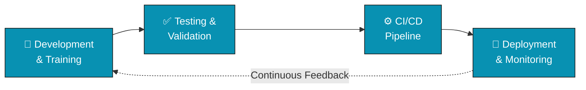

<!-- GitHub Profile README.md Code -->
# Hi there!  I'm Annamalai KM

### Deep Learning Engineer&nbsp;•&nbsp;NLP Specialist&nbsp;•&nbsp;AI Solutions Architect

  <a href="https://www.techknots.in">

With 1 year of focused experience in AI/ML development and software engineering, I build intelligent systems that bridge cutting-edge deep learning, NLP, robotics, and IoT with practical, real-world applications.

  
  
  
  

* 🌍 Based in India
* 🧠 Currently exploring LLMs, AI agents, MLOps, robotics, and IoT integrations
* 🤝 Open to collaborating on AI/ML projects, chatbots, and intelligent systems
* ⚡ Passionate about combining AI with robotics for real-world impact
* 🃏 Jack of all trades across languages, infra, and tooling

  

  
  

 

---

## 🧠 Core Expertise & Technical Skills

**Languages**

  
  
  
  
  
  
  
  
  
  
  
  
  
  

**AI & Machine Learning**

  
  
  
  
  
  
  
  
  
  
  
  
  
  

**Backend & Frontend**

  
  
  
  
  
  
  
  
  
  

**Databases**

  
  
  
  
  
  
  
  

**Cloud, DevOps & Infra**

  
  
  
  
  
  
  
  
  
  
  
  
  
  
  
  
  
  
  

**IoT, Robotics & Tooling**

  
  
  
  
  
  
  
  
  
  
  

**Model Architectures I Work With**

  
  
  
  
  

**Research Interests**

  
  
  
  
  

---

## 🔄 DevOps & Deployment Workflow

---

## 🚀 Featured Projects

<table>
<tr>
<td width="50%" valign="top">

### 💬 Intelligent Conversational Agent
Transformer-based conversational AI with intent recognition and contextual understanding — **85% accuracy** on complex user queries.

`PyTorch` `Hugging Face Transformers` `FastAPI`

</td>
<td width="50%" valign="top">

### 👁️ Computer Vision for Object Recognition
Real-time object detection system optimized for edge devices, enabling efficient processing in resource-constrained environments.

`TensorFlow Lite` `OpenCV` `Raspberry Pi`

</td>
</tr>
<tr>
<td width="50%" valign="top">

### 📡 IoT-Based Smart Monitoring System
End-to-end IoT solution that collects sensor data, processes it with ML, and surfaces predictive insights.

`Arduino` `MQTT` `Time Series Analysis` `Flask`

</td>
<td width="50%" valign="top">

### 🌐 Full-Stack AI Web Application
Web platform integrating NLP for content analysis, sentiment detection, and automated summarization.

`React` `Django` `Hugging Face Pipelines` `PostgreSQL`

</td>
</tr>
</table>

---

## 💻 AI Project Showcase

<table>
<tr><th align="left">Project</th><th align="left">Stack</th><th align="left">Impact</th></tr>
<tr><td><b>LLM-Powered Virtual Assistant</b> Context-aware assistant using fine-tuned LLMs</td><td>PyTorch, Transformers, FastAPI</td><td>⬇️ 60% customer response time</td></tr>
<tr><td><b>Multilingual Text Analysis</b> Sentiment analysis across 5 languages</td><td>Hugging Face, BERT, Flask</td><td>🌍 Global market intelligence for e-commerce</td></tr>
<tr><td><b>Real-time Object Detection</b> Optimized CV system for edge devices</td><td>YOLOv5, TensorFlow Lite, OpenCV</td><td>📡 Intelligent monitoring on constrained hardware</td></tr>
<tr><td><b>Medical Image Analysis</b> CNN-based scan anomaly detection</td><td>PyTorch, U-Net, Django</td><td>🩺 91% accuracy in early detection</td></tr>
<tr><td><b>Autonomous Navigation Robot</b> Mapping & navigation in complex environments</td><td>ROS, SLAM, Computer Vision</td><td>📦 Affordable automated inventory management</td></tr>
<tr><td><b>Smart Agriculture IoT System</b> Sensor network with ML-based prediction</td><td>Arduino, TensorFlow, MQTT</td><td>🌾 +25% crop yield, optimized resource use</td></tr>
<tr><td><b>AI-Enhanced E-learning Platform</b> Personalized content recommendations</td><td>React, Django, MongoDB</td><td>📈 +40% user engagement</td></tr>
<tr><td><b>Predictive Analytics Dashboard</b> Interactive ML-powered forecasting</td><td>React, Flask, Scikit-learn, D3.js</td><td>📊 Actionable BI for data-driven decisions</td></tr>
</table>

---

## 🏆 Certifications & Continuous Learning

<table>
<tr><td valign="top" width="50%">

**Certifications**
- 🎓 Deep Learning Specialization — Coursera
- 🎓 Natural Language Processing with PyTorch
- 🎓 TensorFlow Developer Certificate
- 🎓 AWS Machine Learning Specialty
- 🎓 Google Cloud Professional ML Engineer

</td><td valign="top" width="50%">

**Currently Learning**
- 📚 LLM Architectures & Fine-tuning
- 📚 MLOps & Responsible AI Practices
- 📚 Advanced Robotics Integration with AI
- 📚 Full-Stack AI Application Development
- 📚 Edge AI & IoT Systems

</td></tr>
</table>

### 🏅 Earned Badges & Verifications

  
  
  

---

## 🌱 Current Explorations

- 🤖 Building LLM-powered autonomous agents for specialized tasks
- 🦾 Integrating AI with robotics for industrial automation
- 📡 Developing edge AI applications for resource-limited IoT devices
- 🧩 Creating full-stack applications with embedded AI capabilities
- 🏥 Exploring AI-driven solutions for healthcare and sustainability
- ⚙️ Experimenting across Rust, Go, Scala, and Fortran for performance-critical components

## 📝 Recent Blog Posts & Publications

- 📄 Implementing Transformer Models for Real-World NLP Applications
- 📄 Edge AI: Deploying Machine Learning on Resource-Constrained Devices
- 📄 Building End-to-End AI Systems: From Data Collection to Deployment
- 📄 The Intersection of IoT and AI: Creating Intelligent Connected Systems
- 📄 Full-Stack Development for AI Applications: Best Practices and Patterns

---

## 🌟 Open Source Contributions

<b>🔀 Recent Activity</b>

 

<!--START_SECTION:pull-requests-->
*This list updates automatically every day via GitHub Actions.*
<!--END_SECTION:pull-requests-->

---

## 📊 GitHub Stats

  
  

---

## 🤝 Let's Connect & Collaborate!

I'm always open to interesting projects and collaborations in AI, ML, robotics, and IoT. Whether you're building cutting-edge applications, researching novel algorithms, or exploring new technological frontiers — let's talk.

### ☕ Support My Work

